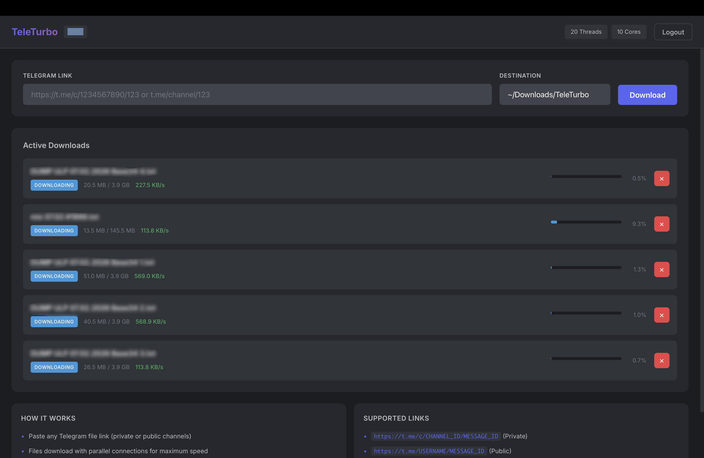

<div align="center">

# TeleTurbo

**High-speed Telegram file downloader with parallel chunked downloads.**

Download files from any Telegram channel at maximum speed using multi-threaded parallel connections.

[]()
[]()



</div>

---

## Download

| Platform | Download | Architecture |
|----------|----------|--------------|
| macOS | [TeleTurbo.dmg](https://github.com/NULLSHADExXx/TeleTurbo/releases/latest/download/TeleTurbo.dmg) | Apple Silicon (ARM64) |
| Windows | [TeleTurbo.exe](https://github.com/NULLSHADExXx/TeleTurbo/releases/latest/download/TeleTurbo.exe) | x86_64 |

## Features

- **Parallel Downloads** — 4-16 concurrent threads to saturate your bandwidth (5-10x faster than standard clients)
- **Private & Public Channels** — Download from any channel you're a member of
- **All Media Types** — Videos, documents, photos, audio — anything Telegram can send
- **Real-time Progress** — Live progress bar, speed, and file size tracking
- **Modern Dark UI** — Clean interface built with React
- **Cross-platform** — Native apps for macOS and Windows
- **Lightweight** — Single binary, no dependencies, under 10MB

## How It Works

Regular Telegram clients download files sequentially:
```
Part 1 → Wait → Part 2 → Wait → Part 3 → Wait...
```

TeleTurbo downloads in parallel:
```
Thread 1 → Part 1  ┐
Thread 2 → Part 2  │ simultaneous
Thread 3 → Part 3  │
Thread 4 → Part 4  ┘
```

## Quick Start

1. Download for your platform above
2. Get API credentials from [my.telegram.org](https://my.telegram.org) (API development tools → Create app)
3. Launch TeleTurbo, enter App ID + App Hash
4. Login with phone number + OTP code
5. Paste any Telegram link and download at full speed

### Supported Link Formats

```
https://t.me/c/1234567890/123     (Private channel)
https://t.me/channelname/123      (Public channel)
t.me/c/1234567890/123             (Short format)
```

## Tech Stack

- **Backend** — Go + gotd/td (pure Go Telegram client)
- **Frontend** — React + TypeScript
- **Framework** — Wails v2 (Go + WebView)

## License

MIT
